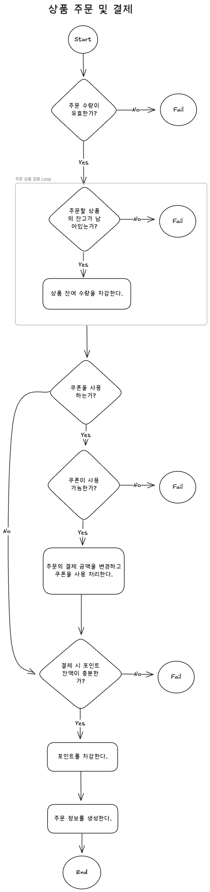
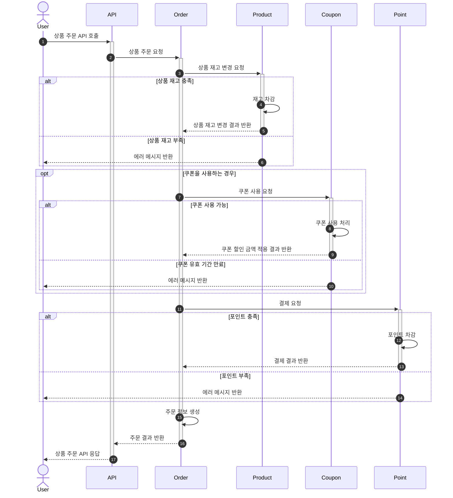

# 시나리오 분석

## 유스케이스
1. 사용자는 상품 주문에 필요한 **상품 정보들을 조회**할 수 있습니다.
2. 사용자는 **상품을 선택하여 주문**할 수 있고, **미리 충전한 잔액을 사용**합니다.
3. 최근 3일간 가장 많이 팔린 **상위 5개 상품 정보**를 조회할 수 있습니다.
4. 사용자는 **선착순으로 할인 쿠폰을 발급**받을 수 있습니다.
5. 사용자는 **잔액을 충전 및 조회**할 수 있습니다.
6. 주문 시에 **할인 쿠폰을 사용**하면 **할인된 주문 가격으로 주문**할 수 있습니다.

## 도메인 설계 및 주요 정책 수립

### 포인트
- 포인트 충전 시 1회 충전 최소 금액은 만 이상, 백만 이하여야 합니다.
- 포인트 최대 잔액은 백만입니다.

### 상품
- 상품 상태는 `판매 중`, `판매 중단`으로 구분합니다.
- 상품별 잔고가 소진되면 `품절`으로 확인됩니다.
- 인기 상품 목록은 한 시간에 한 번 갱신합니다.

### 주문
- 주문과 결제는 동시에 이루어집니다.
- 상품별 주문 수량은 0보다 커야 합니다.
- 상품별 주문 수량은 상품 잔여 수량을 초과할 수 없습니다.
- 주문 시 쿠폰을 사용하는 경우, 주문자와 쿠폰 소유자는 같아야 합니다.

### 쿠폰
- 발급 전 쿠폰 정보는 `쿠폰`에서, 발급 후 쿠폰 정보는 `발급 쿠폰`에서 관리합니다.
- 선착순 쿠폰은 `쿠폰`의 최대 발급 개수에 맞춰 선착순으로 발급됩니다.
- `발급 쿠폰` 상태는 `사용 가능`, `사용 완료`, `기한 만료`로 구분합니다.
- `쿠폰`은 **발급 기한**이 존재하고, `발급 쿠폰`은 **사용 기한**이 존재합니다.

## Flow Charts

## Sequence Diagram
### 상품 주문
