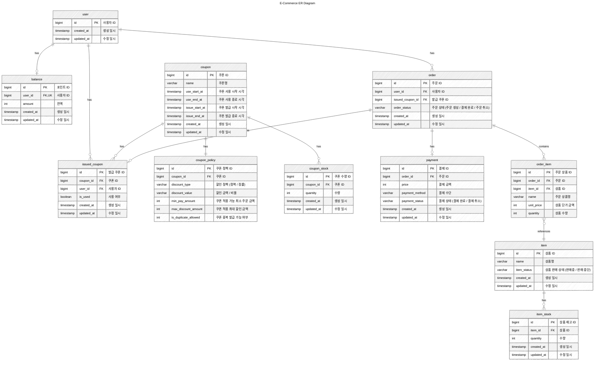

# ERD 설계

## 상태 및 타입 정의 (Status & Type)

### 주문 상태 (order_status)
#### 주문 테이블 (order)

|   Type   | Description |
|:--------:|:-----------:|
| CREATED  |    주문 생성    |
|   PAID   |    결제 완료    |
| CANCELED |    주문 취소    |

### 결제 상태 (payment_status)
#### 결제 테이블 (payment)

|   Type    | Description |
|:---------:|:-----------:|
| COMPLETED |    결제 완료    |
| CANCELED  |    결제 취소    |

### 결제 수단 (method)
#### 결제 테이블 (payment)

| Type  | Description |
|:-----:|:---------:|
| CARD  |     카드    |
| CASH  |     현금    |
| KAKAO |    카카오페이  |
| NAVER |    네이버페이  |
| TOSS  |    토스페이   |

### 상품 상태 (item_status)
#### 상품 테이블 (item)

|  Type   | Description |
|:-------:|:-----------:|
| SELLING |     판매중     |
| STOPPED |    판매 중단    |

### 쿠폰 할인 정책 (discount_type)
#### 쿠폰 정책 테이블 (coupon_policy)

| Type  | Description |
|:-----:|:-----------:|
| FIXED |     정액      |
| RATE  |     정률      |